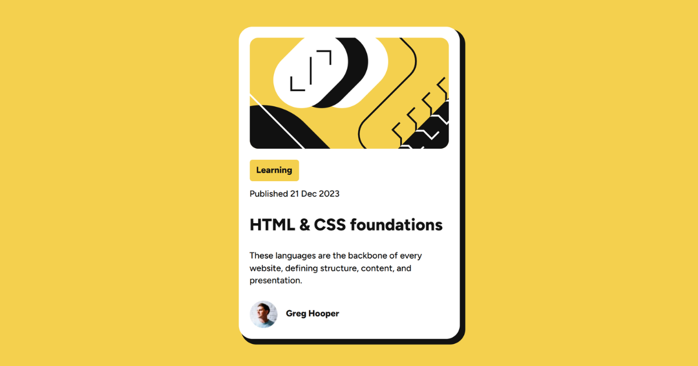

# Frontend Mentor - Blog preview card solution

This is a solution to the [Blog preview card challenge on Frontend Mentor](https://www.frontendmentor.io/challenges/blog-preview-card-ckPaj01IcS). Frontend Mentor challenges help me improve my coding skills by building realistic projects.

## Table of contents

- [Frontend Mentor - Blog preview card solution](#frontend-mentor---blog-preview-card-solution)
  - [Table of contents](#table-of-contents)
  - [Overview](#overview)
    - [Screenshot](#screenshot)
    - [The Challenge](#the-challenge)
    - [Links](#links)
  - [My process](#my-process)
    - [Built with](#built-with)
    - [What I learned](#what-i-learned)
    - [Continued development](#continued-development)
    - [Useful resources](#useful-resources)
  - [Author](#author)

## Overview

### Screenshot

### The Challenge

Your challenge is to build out this blog preview card and get it looking as close to the design as possible.

You can use any tools you like to help you complete the challenge. So if you've got something you'd like to practice, feel free to give it a go.

Your users should be able to:

- See hover and focus states for all interactive elements on the page

### Links

- Solution URL: [Add solution URL here](https://your-solution-url.com)
- Live Site URL: [Add live site URL here](https://your-live-site-url.com)

## My process

### Built with

- Semantic HTML5 markup
- CSS custom properties
- Flexbox
- Mobile-first workflow

### What I learned

- HTML structure: practice semantic HTML by using `<h1>, <h2>, 
, `.
- CSS styling: improve my skill with
  - Flexbox positioning
  - Hover and focus effects
  - Typography (font size, color, background) to match the design
  - Box shadow and border for styling card

### Continued development

- I want to continue improving my CSS layout skills
- I plan to focus more on responsive design, ensuring layout look consistent across all screen sizes
- I also aim to improve my clean and structured code, making it easier to read and maintain

### Useful resources

- [Example resource 1](https://www.example.com) - This helped me for XYZ reason. I really liked this pattern and will use it going forward.
- [Example resource 2](https://www.example.com) - This is an amazing article which helped me finally understand XYZ. I'd recommend it to anyone still learning this concept.

## Author

- Website - [Azam Azis](https://github.com/AzamAzis)
- Frontend Mentor - [@AzamAzis](https://www.frontendmentor.io/profile/AzamAzis)
